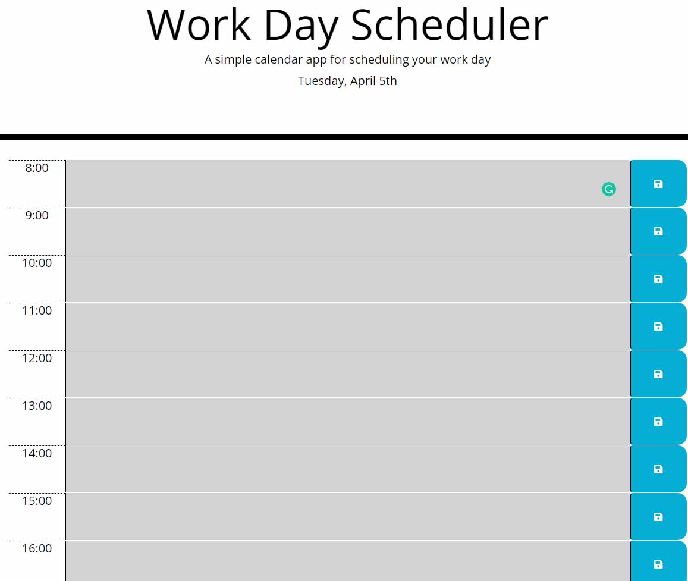
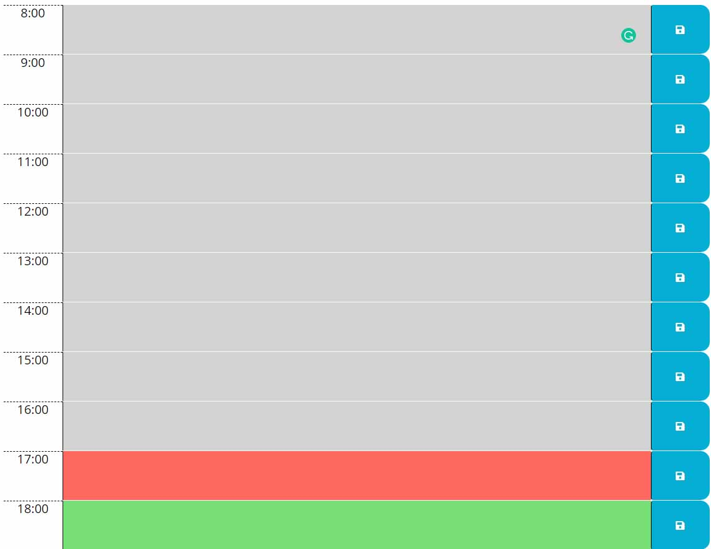
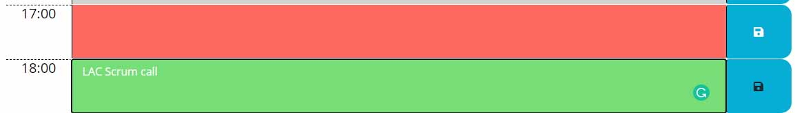

# work-day-scheduler
Calendar application that aalows a user to save events for each hour of the day.

## User Story

```
AS AN employee with a busy schedule
I WANT to add important events to a daily planner
SO THAT I can manage my time effectively
```

## Acceptance Criteria

```
GIVEN I am using a daily planner to create a schedule
WHEN I open the planner
THEN the current day is displayed at the top of the calendar
WHEN I scroll down
THEN I am presented with time blocks for standard business hours
WHEN I view the time blocks for that day
THEN each time block is color-coded to indicate whether it is in the past, present, or future
WHEN I click into a time block
THEN I can enter an event
WHEN I click the save button for that time block
THEN the text for that event is saved in local storage
WHEN I refresh the page
THEN the saved events persist
```

## Deployed app

### URL: https://kuiimaldonado.github.io/work-day-scheduler/

In the main screen you will be displayed with the date and the time blocks 
for each working hour (from 08:00 to 18:00).


The time blocks will have a gray, red or green. Depending on what time is it.
If the time block is referencing:
- Past hour -> gray
- Current hour -> red
- Future hour -> green


To save an event on your scheduler you just simply have to write down in the empty
space. When you are ready click the save button (blue one) besides the event.
This way you will never miss any event during your working hours.
